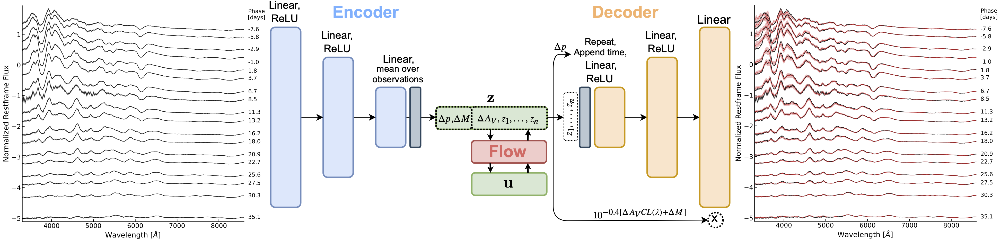

# suPAErnova
This repository contains the codes required to the train models and perform analyses for 

*A Probabilistic Autoencoder for Type Ia Supernovae Spectral Time Series*

Constructed in TensorFlow 2 and TensorFlow Probability.

## Installation
Install the package reqirements with conda

`conda env create -f environment.yml`

Activate conda environment, `conda activate suPAErnova`, and install suPAErnova package in your python environment:

`pip install -e .`

## Use trained models and make plots

See examples in `notebooks/`

`use_PAE_model.ipynb` demonstrates how to use the publicly available trained PAE models to generate new SN observations. 

`plots_and_analysis.ipynb` This notebook creates the plots for the paper. Note that the dataset is not yet public. But, this notebook should give a clear example on how the analysis was performed, and how to reproduce a similar analysis on SN Ia datasets.

The trained models are made public, and you will find them in `../outputs/`

## Training a new PAE model on your dataset
This requires 3 steps. You will find the necessary scripts in `scripts/`:

1.) `suPAErnova/make_datasets/make_train_test_data.py:`
Individual spectra from each supernova first need to be reshaped along the time dimension, as the PAE model requires training data of dimensionality (N\_SN, N\_timesteps, N\_wavelengths), with a corresponding mask array to denote any missing spectra.

2.) `scripts/train_ae.py`:
    Trains the autoencoder based on setup detailed in training configuration file, config/train.yaml`.
    Models are saved to outputs/tensorflow_models/
    
2.) `scripts/train_flow.py`:
    Trains the flow based on setup detailed in training configuration file, `config/train.yaml` 
    Models are saved to `outputs/tensorflow_models/`

## Performing inference with a trained model
`scripts/run_posterior_analysis.py:`
    Runs posterior analysis based on setup detailed in training configuration file, `config/posterior_analysis.yaml`. Outputs are saved to `outputs/`

## Codebase:

suPAErnova/models/: contains custom machine learning models, loading functions, and training loss updates

	autoencoder.py:
		Autoencoder model
	autoencoder_training.py:
		Training functions for autoencoder model
	flows.py:
		Flow model
	flow_training.py:
		Training functions for flow model
	posterior.py:
		posterior analysis setup
	posterior_analysis.py:
		Functions to run posterior analysis
	losses.py:
		Various losses for autoencoder training
	loader.py:
		Load in models

suPAErnova/utils/: contains functionality to load in data and perform a few calculations

	
